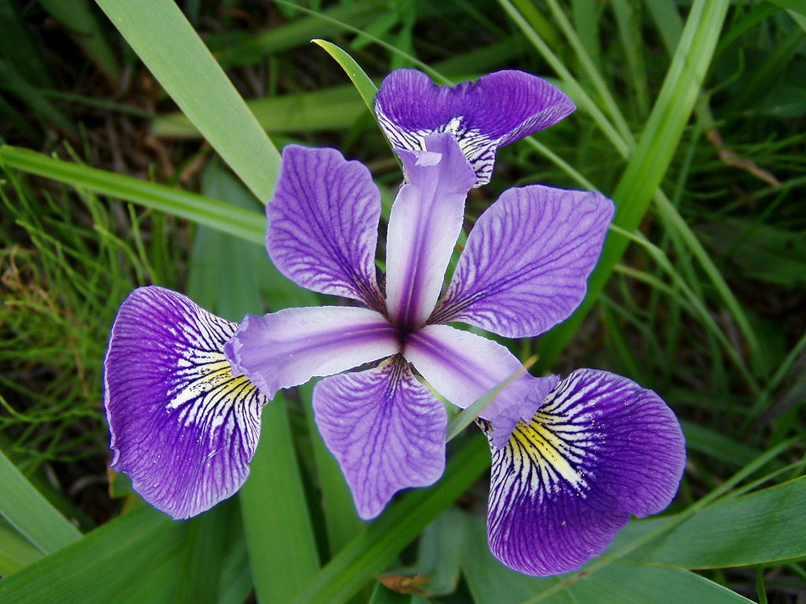
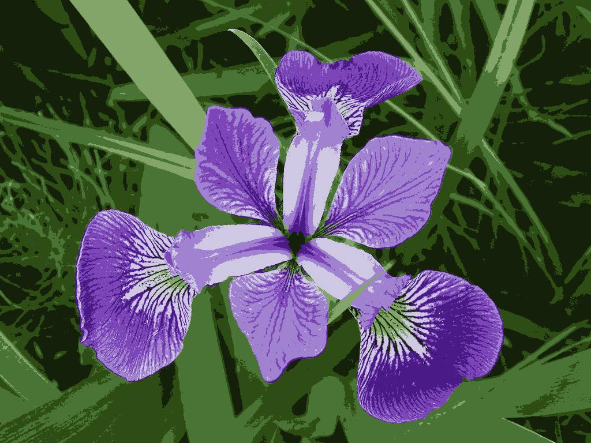
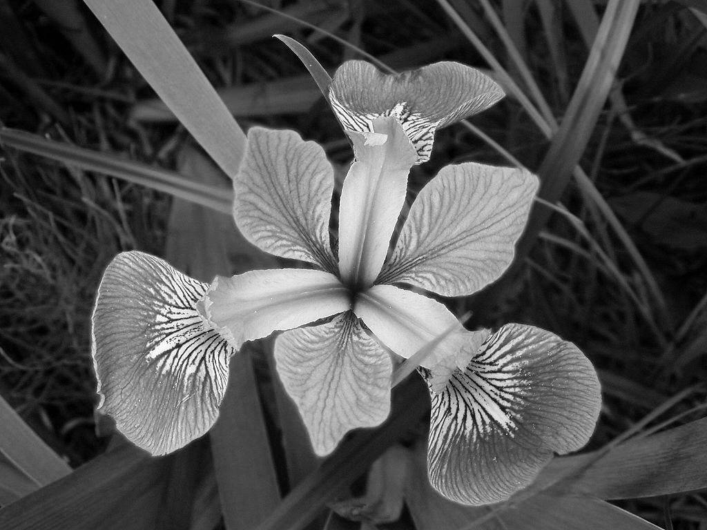

```{r setup, include=FALSE}
knitr::opts_chunk$set(echo = TRUE)
```

# 1. Fragestellung

In der Darstellung bestehen Bilder aus Pixel und der Farbe des Pixels. Die JPEG Norm (siehe z. B. [@hudson2017]) beschreibt z. B. ein Verfahren der Bildkompression. 

Die Wahrnehmung von Farben unterscheidet sich aber, siehe z. B. [@paramei2014]. In dieser kurzen Fallstudie soll untersucht werden, ob und wie die Anzahl der Farben durch eine einfache Clusteranalyse reduziert werden kann und wie das resultierenden Bild aussieht. 

Eine andere Herangehensweise der Komplexitätsreduktion ist die Hauptkomponentenanalyse (siehe z. B. [@mudrova2005]). Auch dies wird vorgestellt. 

# 2. Bilder und Pixel in R

Die Verschiedenfarbige Schwertlilie, lat.: iris versicolor, ist vermutlich eine der drei berühmtesten Blumen in der Statistik und Data-Science. An ihnen wurde im Jahre 1936 von Sir Ronald Aylmer Fisher die Grundlage der *Linearen Diskriminanzanalyse* als Beispiel eingeführt [@fisher1936]. Hier ein Foto von Armin Hauke:

```{r echo=FALSE, out.width = "90%", fig.align="center"}

```


## Vorbereitungen

Pakete laden:
```{r, message=FALSE}
# Ggfs. Paket jpeg installieren
# install.packages("jpeg")
library(jpeg)
# Ggfs. Paket scales installieren
# install.packages("scales")
library(scales)
# Ggfs. Paket mosaic installieren
# install.packages("mosaic")
library(mosaic)
```

Über den Befehl `readJPEG()` aus dem Paket `jpeg` kann das Bild in R eingelesen werden:
```{r}
img <- readJPEG("irisversi.jpg")
```

Darstellung des Bildes in R:
```{r}
dimension <- dim(img)
dimension
```

Es handelt sich um ein 3-dimensionales `array`: $`r dimension[1]` \times `r dimension[2]`$ Pixel mit  $`r dimension[3]`$ Farben: Rot, Gelb, Blau.


In Datenmatrix überführen:
```{r}
img_rgb <- data.frame(
  x = rep(1:dimension[2], each = dimension[1]), # Bildspalte
  y = rep(dimension[1]:1, dimension[2]), # Bildzeile
  R = as.vector(img[,,1]), # Rotanteil
  G = as.vector(img[,,2]), # Gelbanteil
  B = as.vector(img[,,3]) # Blauanteil
)

# Kontrolle
str(img_rgb)
```

Anzahl unterschiedliche Farben:
```{r}
n_color <- img_rgb %>%
  select(R,G,B) %>%
  unique() %>%
  nrow()

n_color
```

Für die $`r nrow(img_rgb)`=`r dimension[2]` \cdot `r dimension[1]`$ Pixel ("Beobachtungen") des Bildes werden `r n_color` verschiedene Farbtöne verwendet.

# 3. Clusteranalyse

k-Means Clusterung der Pixel auf Basis der Farben auf $k=16$ Farbcluster:
```{r, warning=FALSE}
set.seed(1896)
k_means <- kmeans(img_rgb[,c("R","G","B")], centers = 16, 
                  iter.max = 25, nstart = 10)
```

Farbdarstellung der resultierenden 16 Farben:
```{r, fig.align="center"}
k_means$centers %>%
  rgb() %>%
  show_col()
```

Häufigkeitsverteilung der Clusterzentren (Farben):

```{r, fig.align="center"}
gf_col(k_means$size ~ 1:16, fill = rgb(k_means$centers))
```

Es werden überwiegend Grün- und Lilatöne verwendet.

Erzeugung des Bildes, in dem jedem Pixel die Farbe des zugeordneten Zentrums zugewiesen wird:
```{r}
# Datensatz
reduced.df <- k_means$centers[k_means$cluster,]
# Array
img_new <- array(NA, dimension)
for(i in 1:3) img_new[,,i] <- matrix(reduced.df[,i], nrow=dimension[1]) 
# Speichern
writeJPEG(img_new, "irisversi_reduced_cluster.jpg")
```

Das Bild, welches anstatt `r n_color` nur die 16 auf RGB Ebene gelusterten Farben hat sieht wie folgt aus:
```{r echo=FALSE, out.width = "60%", fig.align="center"}
knitr::include_graphics("irisversi_reduced_cluster.jpg")
```


Hinweis: Bei 8 Farben würde man weniger Details erkennen:

```{r echo=FALSE, out.width = "60%", fig.align="center", message=FALSE}
set.seed(1896)
k_means8 <- kmeans(img_rgb[,c("R","G","B")], centers = 8, 
                  iter.max = 25, nstart = 10)
# Datensatz
reduced.df <- k_means8$centers[k_means8$cluster,]
# Array
img_new <- array(NA, dimension)
for(i in 1:3) img_new[,,i] <- matrix(reduced.df[,i], nrow=dimension[1]) 
# Speichern
writeJPEG(img_new, "irisversi_reduced_cluster8.jpg")

```

# 4. Hauptkomponentenanalyse

Durchführen der Hauptkomponentenanalyse der Farbtöne der Pixel:
```{r}
pca <-prcomp(img_rgb[,c("R","G","B")])
summary(pca)
```

Die erste Hauptkomponente der Farbtöne enthält `r summary(pca)$importance[2,1]` der Gesamtvarianz.

Berechnung des Scores jedes Pixels auf der ersten Hauptkomponente:
```{r}
scores <- predict(pca)[,1]
```

Skalierung auf $[0,1]$ durch $x_i=\frac{x_i-\min(x)}{\max(x)-\min(x)}$ als Graustufe:
```{r}
scores <- (scores-min(scores)) / (max(scores)-min(scores))
```

```{r}
# Array
img_new <- array(NA, c(dimension[1:2],1))
img_new[,,1] <- scores
# Speichern
writeJPEG(img_new, "irisversi_reduced_pca1.jpg")
```

Das Bild, welches anstatt `r n_color` Farben nur die Graustufe der ersten Hauptkomponente enthält sieht wie folgt aus:
```{r echo=FALSE, out.width = "60%", fig.align="center"}

```

Das Originalbild ist auch in nur einem Farbton (Graustufen) sehr gut zu erkennen.

Für die weiteren Hauptkomponenten ergibt sich:
```{r}
# 2. Hauptkomponente
scores <- predict(pca)[,2]
scores <- (scores-min(scores)) / (max(scores)-min(scores))
# Array
img_new <- array(NA, c(dimension[1:2],1))
img_new[,,1] <- scores
# Speichern
writeJPEG(img_new, "irisversi_reduced_pca2.jpg")

# 3. Hauptkomponente
scores <- predict(pca)[,3]
scores <- (scores-min(scores)) / (max(scores)-min(scores))
# Array
img_new <- array(NA, c(dimension[1:2],1))
img_new[,,1] <- scores
# Speichern
writeJPEG(img_new, "irisversi_reduced_pca3.jpg")
```

Als Bild:

```{r echo=FALSE, out.width = "60%", fig.align="center", fig.show='hold'}
knitr::include_graphics(c("irisversi_reduced_pca2.jpg","irisversi_reduced_pca3.jpg"))
```

Der Kontrast der Bilder sinkt mit den jeweiligen Hauptkomponenten.

# 5. Ergebnisse und Ausblick

Die Komplexitätsreduktion des Bildes (Original; Oben) durch Clusteranalyse auf 16 Farben (Mitte) oder auf die erste Hauptkomponente als Graustufe (Unten) ergibt insgesamt:

```{r echo=FALSE, out.width = "90%", fig.align="center", fig.show='hold'}
knitr::include_graphics(c("irisversi.jpg","irisversi_reduced_cluster.jpg", "irisversi_reduced_pca1.jpg"))
```


Auch wenn hier naive, statistische Verfahren angewendet wurden, ohne die Besonderheiten von Bildern zu berücksichtigen (siehe z. B. [@sonka2014]), so zeigt das Ergebnis doch, wie klassische Verfahren für Bilder angewendet werden können und das trotz Komplexitätsreduktion die relevante Information erhalten bleiben kann.

Auf Bildebene sind die genannten Verfahren in der Praxis häufig Vorverarbeitungsschritte um z. B. Bilder zu vergleichen oder wiederzuerkennen.

## Komplexitätsreduktion

Stellen Sie sich vor, die vielen Pixel wären Ihre Kund\*innen o.ä., Daten aus Ihrem Umfeld.

Mit der **Clusteranalyse** können Sie ähnliche *Beobachtungen* zusammenfassen: anstatt alle Beobachtungen einzeln zu betrachten können Sie (wenige) Prototypen, die Clusterzentren, analysieren um generelle Muster im Kundenstamm zu erkennen.

Bei der **Hauptkomponentenanalyse** fassen Sie *Variablen* zusammen: anstatt alle Variablen einzeln zu betrachten fassen Sie diese zu wenigen Hauptkomponenten zusammen.

In beiden Fällen hat sich die Komplexität Ihrer Aufgabe reduziert.


***

# Anhang: Versionshinweise

- Datum erstellt: `r Sys.Date()`
- R Version: `r getRversion()`

Verwendete Pakte:

- `jpeg` Version: `r packageVersion("jpeg")`
- `scales` Version: `r packageVersion("scales")`
- `mosaic` Version: `r packageVersion("mosaic")`

# Literatur


